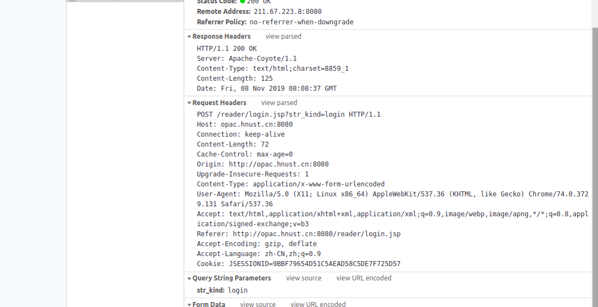

## 技术沙龙之图书借阅
目的： 学习爬虫内部原理 -->  代码实现 --> 项目功能的实现 。 `如果出现有错误的地方，请指出互相学习!`  

爬虫简单的来讲就是模仿浏览器来打开网页。发送一个 Http 请求，获取响应报文主体信息,然后解析出自己需要的信息。

### 1、什么是HTTP协议？
```
超文本传输协议（英文：HyperText Transfer Protocol，缩写：HTTP）是互联网上应用最为广泛的一种网络协议。
设计HTTP最初的目的是为了提供一种发布和接收HTML页面的方法。
通过HTTP或者HTTPS协议请求的资源由统一资源标识符（Uniform Resource Identifiers，URI）来标识。
```
*我：Http 协议的存在，就是为了方便信息共享传输，能让远隔两地的学习者们共享知识的东西。*

### 2. HTTP 报文内的 HTTP 信息
* HTTP 报文的三个部

* 浏览器模拟请求 [图书馆登录](http://opac.hnust.cn:8080/reader/login.jsp) 的 http 报文信息 
* **请求行** ：请求报文请求服务器对资源进行一些操作。请求报文的起始行，或称为请求行，包含了**一个方法**和**一个请求URL**，这个方法描述了服务器应该执行的操作，请求URL描述了要对哪个资源执行这个方法。请求行中还包含** HTTP 的版本**，用来告知服务器，客户端使用的是哪种HTTP。
* **各种首部字段**
```
Host : 请求资源所在服务器
Connection: 逐跳首部、连接的管理
Keep-Alive : Keep-Alive 功能使客户端到服务器端的连接持续有效，当出现对服务器的后继请求时，Keep-Alive 功能避免了建立或者重新建立连接。
还可以用来设置超时时长和最大请求数。
Content-Length : 实体主体的大小（单位：字节）
Cache-Control : 控制缓存的行为
max-age=<seconds> ：设置缓存存储的最大周期，超过这个时间缓存被认为过期(单位秒)。与Expires相反，时间是相对于请求的时间。
max-age = 0 : 缓存服务器需要将请求转发给源服务器。
Origin : 指示了请求来自于哪个站点,该字段仅指示服务器名称，并不包含任何路径信息。
Upgrade-Insescure_Requests: 是一个请求首部，用来向服务器端发送信号，表示客户端优先选择加密及带有身份验证的响应 。
Content-Type ： 实体主体的媒介类型
application/x-www-form-urlencoded: 数据被编码成以 '&' 分隔的键-值对, 同时以 '=' 分隔键和值 。
User-Agent : HTTP 客户端程序的信息
Accept : 用户代理可处理的媒体类型
Referer : 请求头包含了当前请求页面的来源页面的地址，即表示当前页面是通过此来源页面里的链接进入的
Accept-Encoding : 优先的内容编码
Accept-Language : 优先的语言
Cookie : 状态管理
```

### 3. postman 模拟请求实现
### 4. 命令行实现
```bash
curl http://opac.hnust.cn:8080/reader/login.jsp?str_kind=login -X POST -d 'barcode=&fangshi=1&identification_id=1705020313&password=888888' --cookie-jar testCookie.txt
curl http://opac.hnust.cn:8080/reader/infoList.jsp --cookie "JSESSIONID=7472F0F5E29502716B33C9EB5B31F230;"
```
### 5. PHP 代码实现


附 ：   
[彻底弄懂HTTP缓存机制及原理](https://www.cnblogs.com/chenqf/p/6386163.html)  
[聊一聊 cookie](https://juejin.im/post/5b18d322e51d4506cf10af7c)  
[把cookie聊清楚](https://juejin.im/post/59d1f59bf265da06700b0934)  
[HTTP Keep-Alive模式](https://www.cnblogs.com/skynet/archive/2010/12/11/1903347.html)   
[WEB安全之-CSRF（跨站请求伪造）](https://www.jianshu.com/p/855395f9603b)  
[前端安全系列之二：如何防止CSRF攻击？](https://juejin.im/post/5bc009996fb9a05d0a055192)  
[浅谈XSS攻击的那些事（附常用绕过姿势）](https://zhuanlan.zhihu.com/p/26177815) 